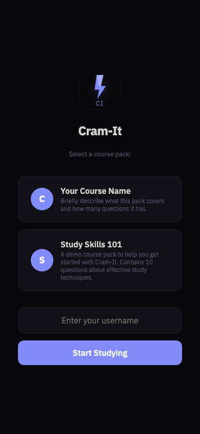
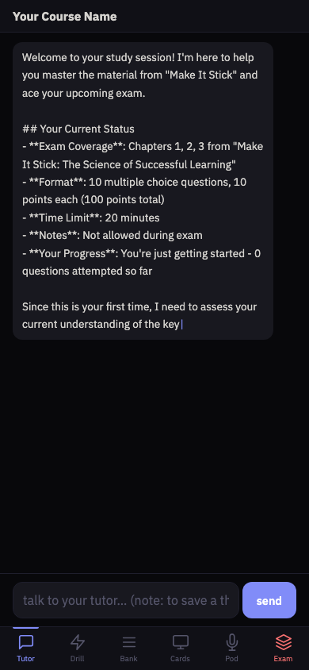

# Cram-It

**AI-Powered Exam Prep Platform**


Cram-It is a self-hosted, multi-course study engine that combines FSRS spaced repetition, AI tutoring via Claude, real-time multiplayer battle mode, and LMS integrations into a single installable PWA.

<p align="center">
  &nbsp;&nbsp;&nbsp;
  
</p>

---

## Features

- **Smart Drill Engine** — 4-phase question selection: FSRS-due, weak concepts, unseen topics, reinforcement
- **AI Tutor** — Persistent Claude conversations with RAG-enriched context from your textbook and slides
- **Exam Mode** — Timed practice exams matching your real exam's format and topic distribution
- **Battle Mode** — Kahoot-style real-time multiplayer quiz battles via Socket.IO
- **Question Bank** — Filterable browser with mastery tracking per question
- **Concept Map** — Visual drill map showing mastery per concept with prerequisites
- **AI Question Generator** — Generates similar practice questions when you miss one
- **ChromaDB RAG** — Semantic search over textbook chunks and lecture slides
- **LMS Integrations** — Pull quizzes from Canvas, Learning Suite, or PDFs
- **PWA** — Install on iPhone, Android, or desktop with offline support
- **Pack System** — Multi-course support with swappable course packs
- **Podcast Generation** — Two-voice review podcasts via Edge-TTS
- **Interactive Graphs** — JSXGraph-powered dynamic visualizations

---

## Quick Start

### 1. Clone

```bash
git clone https://github.com/babyLegionite/cram-it.git
cd cram-it
```

### 2. Install Dependencies

```bash
python3 -m venv venv
source venv/bin/activate
pip install -r requirements.txt
```

### 3. Configure

```bash
cp .env.example .env
# Edit .env and add your ANTHROPIC_API_KEY
```

### 4. Add a Course Pack

Copy the template and fill in your course data:

```bash
cp -r packs/_template packs/my-course
# Edit packs/my-course/pack.yaml and add your questions
```

Or use an ingestion tool:

```bash
python tools/ingest_canvas.py --course-id 12345 --output packs/my-course/
```

See [Creating Packs](docs/CREATING_PACKS.md) for detailed instructions.

### 5. Run

```bash
python server.py
```

Open `http://localhost:3000` in your browser.

For Battle Mode (optional):
```bash
cd kahoot && python game.py  # Runs on port 4000
```

---

## Screenshots

<!-- TODO: Add screenshots -->
<!--  -->
<!--  -->
<!--  -->
<!--  -->

---

## Architecture

Cram-It is built as a Flask backend serving a single-page PWA frontend:

```
┌─────────────┐     ┌──────────────┐     ┌───────────────┐
│   PWA SPA   │────▶│  Flask API   │────▶│  SQLite +     │
│  (Mobile /  │◀────│  (server.py) │◀────│  ChromaDB     │
│   Desktop)  │     │              │     │               │
│             │     │  Claude API  │     │  Course Packs │
│  Drill      │     │  FSRS        │     │  (YAML+JSON)  │
│  Tutor      │     │  RAG         │     │               │
│  Exam       │     │              │     │               │
│  Battle     │     └──────────────┘     └───────────────┘
└─────────────┘
```

The **4-phase drill algorithm** selects questions using:
- **30% FSRS-due**: Spaced repetition scheduled reviews
- **25% Weak concepts**: Mastery < 50% with 2+ attempts
- **25% Unseen**: Concepts not yet attempted
- **20% Reinforcement**: Persistent weak spots

See [docs/ARCHITECTURE.md](docs/ARCHITECTURE.md) for the full system design.

---

## Documentation

| Document | Description |
|----------|-------------|
| [Architecture](docs/ARCHITECTURE.md) | System design, data flow, algorithms |
| [Creating Packs](docs/CREATING_PACKS.md) | How to build a course pack |
| [LMS Integrations](docs/LMS_INTEGRATIONS.md) | Canvas, Learning Suite, Cengage setup |
| [Deployment](docs/DEPLOYMENT.md) | Self-hosting, Docker, Cloudflare Tunnel |
| [Hermes Integration](docs/HERMES_INTEGRATION.md) | AI agent workflow |

### Skill Files (for AI Agents)

| Skill | Description |
|-------|-------------|
| [Tutor Architecture](docs/skills/tutor-architecture.md) | Server internals, FSRS, endpoints |
| [Graph Rendering](docs/skills/graph-rendering.md) | JSXGraph integration |
| [Podcast Generation](docs/skills/podcast-generation.md) | Edge-TTS pipeline |
| [Canvas Integration](docs/skills/canvas-integration.md) | Canvas API patterns |
| [Grade Portal](docs/skills/grade-portal.md) | Grade fetching |

---

## Project Structure

```
cram-it/
├── server.py                 # Flask backend (main application)
├── engine/
│   ├── tutor_plugin.py       # FSRS + mastery + drill logic
│   └── similar_generator.py  # AI question generation
├── kahoot/
│   └── game.py               # Battle Mode (Socket.IO)
├── packs/
│   ├── _template/            # Empty pack template
│   └── <course-packs>/      # Your course data
├── templates/
│   └── index.html            # PWA single-page app
├── static/
│   ├── graphs.js             # JSXGraph renderer
│   ├── graph_exercises.js    # Interactive exercises
│   ├── sw.js                 # Service worker
│   └── manifest.json         # PWA manifest
├── tools/                    # Pack creation utilities
├── data/                     # Runtime data (gitignored)
│   ├── learner.db            # SQLite database
│   ├── chroma_db/            # ChromaDB embeddings
│   └── profiles/             # User learning profiles
├── docs/                     # Documentation
│   ├── skills/               # Hermes skill files
│   └── *.md                  # Guides
├── .env.example              # Environment template
├── requirements.txt          # Python dependencies
├── AGENTS.md                 # For AI agent collaborators
└── LICENSE                   # MIT License
```

---

## Contributing

1. Fork the repository
2. Create a feature branch: `git checkout -b feature/my-feature`
3. Make your changes
4. Test with an existing pack
5. Submit a pull request

### Development Tips

- Read [AGENTS.md](AGENTS.md) for an overview of conventions
- Read the relevant [skill file](docs/skills/) before modifying a subsystem
- Keep personal data out of commits (use `.env` for secrets, `.gitignore` for data)
- Test drill modes with at least 20 questions in the pack

---

## License

MIT License — see [LICENSE](LICENSE) for details.

---

## Built With

- [Flask](https://flask.palletsprojects.com/) — Web framework
- [Claude](https://www.anthropic.com/) (Anthropic) — AI tutoring and question generation
- [ChromaDB](https://www.trychroma.com/) — Vector database for RAG
- [FSRS](https://github.com/open-spaced-repetition/py-fsrs) — Spaced repetition algorithm
- [sentence-transformers](https://www.sbert.net/) — Embedding model (all-MiniLM-L6-v2)
- [Flask-SocketIO](https://flask-socketio.readthedocs.io/) — Real-time Battle Mode
- [JSXGraph](https://jsxgraph.uni-bayreuth.de/) — Interactive graph rendering
- [Edge-TTS](https://github.com/rany2/edge-tts) — Voice synthesis for podcasts
